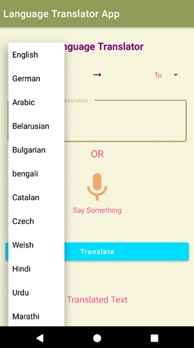
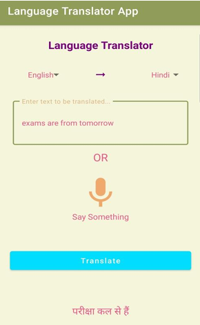

# Android Language Translator

An Android application designed with accessibility in mind, enabling speech-based language translation for visually impaired users.

## Overview
This project focuses on building a voice-driven translation application that allows users to speak input, translate it into another language, and listen to the translated output using text-to-speech.

## Key Features
- Speech-to-text input using the device microphone
- Real-time language translation
- Text-to-speech output for hands-free usage
- Support for multiple regional languages
- Accessibility-focused interaction design

## Motivation
The application was designed to improve accessibility for visually impaired users by enabling voice-based interaction without reliance on on-screen text.

## Tech Stack
- Android (Java)
- Android Speech Recognition APIs
- Text-to-Speech (TTS)
- Translation APIs

## Status
Academic project focused on accessibility and mobile application development.

## Screenshots

